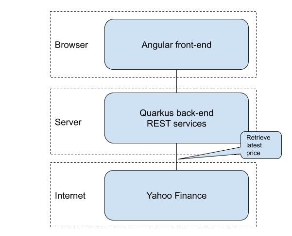

= Portfolio1
I am building an application to keep track of a stock portfolio. This has an Angular front-end with a REST services back-end implemented
with Quarkus.

.The features of the first version:
- list of stocks
- retrieve latest prices from Yahoo Finance

This is the architecture of the application:

== Project setup
Let us start with an empty project by specifying the extensions on https://code.quarkus.io and download the resulting zip.

.The necessary extensions:
* RESTeasy JAX-R
* RESTeasy JSON-B

To make sure the development environment works, you start the development mode with Maven:
----
mvn compile quarkus:dev
----

In your browser, enter http://localhost:8080/hello and you will see "hello" as a response.

=== Add Yahoo finance API dependency
The retrieve the latest stock price, I add this dependency:
----
  <dependency>
    <groupId>com.yahoofinance-api</groupId>
    <artifactId>YahooFinanceAPI</artifactId>
    <version>3.15.0</version>
  </dependency>
----

To get the stock information, including price:
----
Stock stock = YahooFinance.get(symbol);
----

== Stock REST resource
It will be necessary get the latest stock price through a REST service, so we add the StockResource:

----
  @Path("/{symbol}/latestPrice")
  @GET
  public Response stock(@PathParam("symbol") String symbol) throws IOException {
    Stock stock = YahooFinance.get(symbol);

    Response response = null;
    if (stock == null) {
      response = Response.status(Response.Status.NOT_FOUND).build();
    } else {
      StockLatestPriceResponse stockResponse = new StockLatestPriceResponse(stock.getSymbol(), stock.getQuote().getPrice());
      response = Response.ok(stockResponse).build();
    }
    return response;
  }
----

We can test this by accessing this URL: http://localhost:8080/stocks/AAPL/latestPrice

== Angular front-end
To bootstrap the Angular application, run this in the src/main directory:
----
ng new portfolio --skipGit --routing=true --style=scss
----

This creates a new directory "portfolio" with the Angular code. I rename that to "angular" to make it obvious that it contains Angular
front-end code.

To run the front-end, change directory to the src/main/angular directory and run `ng serve`. When you enter "http://localhost:4200" in
your browser, you will see the example page with "portfolio app is running".

I add the PrimeNG package - this contains nice user interface components.
----
npm install --save primeng
npm install --save primeicons
npm install --save @angular/cdk
npm install --save chart.js
npm install --save @fullcalendar/core
----

=== Portfolio page
Next I create a Portfolio page to display the list of stocks, and the service to retrieve the latest price.
----
ng generate component Portfolio
ng generate service Stock
----

You can see how I implemented the page on https://github.com/koert/portfolio1[my Github repository].

=== Stock price service
To retrieve the latest stock price, the StockService calls the REST endpoint implemented in Quarkus.

----
  getStockLatestPrice(symbol: string): Observable<StockLatestPriceResponse> {
    return this.http.get<StockLatestPriceResponse>(`/stocks/${symbol}/latestPrice`);
  }
----

To check if it works, you can run `ng serve` again.

You will see errors in the browser console:
----
GET http://localhost:4200/stocks/AAPL/latestPrice 404 (Not Found)
GET http://localhost:4200/stocks/GOOG/latestPrice 404 (Not Found)
----

The Angular service expects that the Quarkus service is available at the same URL prefix, and this is http://localhost:4200. The Quarkus
service actually lives at http://localhost:8080, so will will need a proxy.

.proxy.conf.json
----
{
  "/stocks": {
    "target": "http://localhost:8080",
    "secure": false
  }
}
----

If you have started Quarkus with `mvn compile quarkus:dev`, then you can start the Angular app with `ng serve --proxy-config proxy.conf.json`.

== Combine Quarkus and Angular
So far, the Quarkus service and Angular application are separated. The Angular production build with `ng build --prod` produces static files
that can be served by Quarkus.

By default, `ng build --prod` puts all produced files in the dist directory. We want those files in the src/main/resources/META-INF/resources
directory. You can change that in the angular.json file:

.angular.json
----
  "configurations": {
    "production": {
      "outputPath": "../resources/META-INF/resources",
----

After running `ng build --prod`, you can start Quarkus with `mvn compile quarkus:dev` and load the Angular app with http://localhost:8080/index.html

== Running the application
Now we have an application that we can deploy and run. Quarkus gives you the ability to run the application as a native executable.
When you build the application with `mvn package -Pnative -Dquarkus.native.container-build=true -Dmaven.test.skip`, it will build a
runner executable that contains everything it needs. This executable starts up very quickly and is great for running in a Docker container.

After building the executable, you can build a Docker image and run it:
----
docker build -f src/main/docker/Dockerfile.native -t quarkus/portfolio .
docker run -i --rm -p 8080:80 quarkus/portfolio
----

After that, you can access the application at http://localhost:8080/index.html

See the Github repository at: https://github.com/koert/portfolio1
